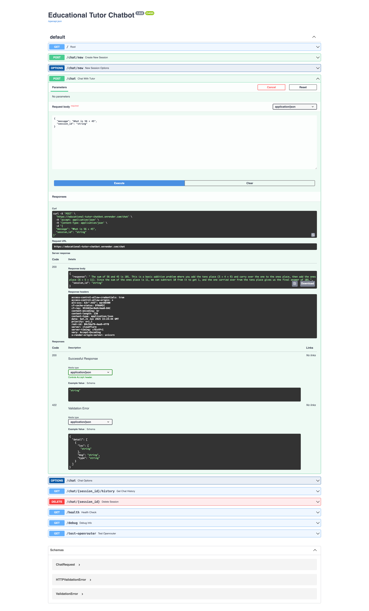

# Educational Tutor Chatbot

A FastAPI-based chatbot with a modern web interface that acts as an educational tutor for students from Class 1 to Class 12. Features both a beautiful frontend and API endpoints, with demo mode and full AI-powered responses.

## 🌐 Live Deployment

**💬 Web Chat Interface:** https://educational-tutor-chatbot.onrender.com

**📚 Interactive API Documentation:** https://educational-tutor-chatbot.onrender.com/docs

**💚 Health Check:** https://educational-tutor-chatbot.onrender.com/health

## ✨ Features

### 🎨 **Frontend Interface**
- **Modern Chat UI**: Beautiful, responsive web interface with gradient design
- **Real-time Chat**: Instant messaging with typing indicators and timestamps
- **Sample Questions**: Pre-built educational questions to get started quickly
- **Mobile Friendly**: Responsive design that works on all devices
- **Demo Mode**: Works immediately without API key configuration

### 🤖 **AI-Powered Backend**
- **Educational Tutoring**: Powered by Mistral 7B Instruct model via OpenRouter
- **Session Management**: In-memory chat sessions with conversation history
- **Smart Responses**: Context-aware educational explanations
- **Multi-Subject Support**: Math, Science, English, History, and more

### 🛠️ **Technical Features**
- **RESTful API**: Clean FastAPI endpoints for chat interactions
- **CORS Enabled**: Browser-compatible for web applications
- **Auto-deployed**: Hosted on Render with auto-scaling
- **Free to Use**: Demo mode works without API costs

## API Endpoints

### Chat Endpoints
- `POST /chat/new` - Create a new chat session
- `POST /chat` - Send a message to the tutor
- `GET /chat/{session_id}/history` - Get chat history for a session
- `DELETE /chat/{session_id}` - Delete a chat session

### Utility Endpoints
- `GET /` - Serves the web chat interface
- `GET /api` - API information endpoint
- `GET /health` - Health check endpoint

## 🔧 Environment Variable Setup

### For Render Deployment:
1. **Go to Render Dashboard:** https://dashboard.render.com
2. **Select your service:** `educational-tutor-chatbot`
3. **Go to "Environment" tab**
4. **Add environment variable:**
   - **Key:** `OPENROUTER_API_KEY`
   - **Value:** Your OpenRouter API key (starts with `sk-or-v1-...`)
5. **Save** - Render will automatically redeploy

### For Local Development:
1. **Copy the example file:**
   ```bash
   cp .env.example .env
   ```
2. **Edit `.env` file:**
   ```bash
   OPENROUTER_API_KEY=your_openrouter_api_key_here
   ```

### Getting Your OpenRouter API Key:
1. **Visit:** https://openrouter.ai
2. **Sign up/Login** using Google, GitHub, or MetaMask
3. **Go to "Keys" section**
4. **Create a new API key**
5. **Copy the key** (format: `sk-or-v1-...`)

## 🚀 Render Deployment Guide

### Quick Deploy:
1. **Fork this repository** to your GitHub account
2. **Go to Render:** https://render.com
3. **Click "New +"** → **"Web Service"**
4. **Connect your GitHub repository**
5. **Configure:**
   - **Name:** `educational-tutor-chatbot`
   - **Region:** Oregon (US West)
   - **Branch:** `main`
   - **Build Command:** `pip install --upgrade pip && pip install --no-cache-dir -r requirements.txt`
   - **Start Command:** `uvicorn main:app --host 0.0.0.0 --port $PORT`
6. **Add Environment Variable:**
   - **Key:** `OPENROUTER_API_KEY`
   - **Value:** Your OpenRouter API key
7. **Click "Create Web Service"**
8. **Wait for deployment** (2-3 minutes)
9. **Test your API** at the provided URL

### Using render.yaml (Alternative):
This repository includes a `render.yaml` file for automatic configuration:
1. **Connect repository to Render**
2. **Render will auto-detect the configuration**
3. **Just set the environment variable**
4. **Deploy!**

## 💻 Local Setup Guide

### Prerequisites:
- Python 3.10+ installed
- pip package manager

### Installation Steps:

1. **Clone the repository:**
   ```bash
   git clone https://github.com/Hasib303/educational-tutor-chatbot-final.git
   cd educational-tutor-chatbot-final
   ```

2. **Create virtual environment (recommended):**
   ```bash
   python -m venv venv
   
   # On Windows:
   venv\Scripts\activate
   
   # On Mac/Linux:
   source venv/bin/activate
   ```

3. **Install dependencies:**
   ```bash
   pip install -r requirements.txt
   ```

4. **Set up environment variables:**
   ```bash
   cp .env.example .env
   # Edit .env and add your OpenRouter API key
   ```

5. **Run the application:**
   ```bash
   uvicorn main:app --reload
   ```

6. **Access your chatbot:**
   - **Web Interface:** http://localhost:8000
   - **API Docs:** http://localhost:8000/docs
   - **Health Check:** http://localhost:8000/health

### Testing Locally:
```bash
# Test basic functionality
curl http://localhost:8000/health

# Test chat functionality
curl -X POST "http://localhost:8000/chat" \
  -H "Content-Type: application/json" \
  -d '{"message": "Hello, can you help me with math?"}'
```

## 🚀 Usage Instructions

### Method 1: Web Chat Interface (Recommended)
**Simply visit:** https://educational-tutor-chatbot.onrender.com

1. **Instant Access**: No setup required, works immediately in demo mode
2. **Try Sample Questions**: Click any of the pre-built educational questions
3. **Ask Anything**: Type your own questions about math, science, English, or history
4. **Session Management**: Use "New Chat" and "Clear" buttons as needed

### Method 2: API Documentation Interface
Visit the interactive API documentation: https://educational-tutor-chatbot.onrender.com/docs

1. Find the `POST /chat` endpoint
2. Click "Try it out"
3. Enter your message in JSON format:
   ```json
   {
     "message": "Explain photosynthesis for a 5th grade student"
   }
   ```
4. Click "Execute" to get the tutor's response

### Method 3: Command Line (curl)

#### Create a new session:
```bash
curl -X POST "https://educational-tutor-chatbot.onrender.com/chat/new"
```

#### Chat with the tutor:
```bash
curl -X POST "https://educational-tutor-chatbot.onrender.com/chat" \
  -H "Content-Type: application/json" \
  -d '{"message": "What is 5 + 3? Explain simply."}'
```

#### Chat with session history:
```bash
curl -X POST "https://educational-tutor-chatbot.onrender.com/chat" \
  -H "Content-Type: application/json" \
  -d '{
    "message": "Now explain multiplication", 
    "session_id": "your-session-id-from-previous-response"
  }'
```

### Method 4: Programming Languages

#### Python Example:
```python
import requests

response = requests.post(
    "https://educational-tutor-chatbot.onrender.com/chat",
    json={"message": "Explain fractions for a 4th grader"}
)
result = response.json()
print(result["response"])
```

<!-- #### JavaScript Example:
```javascript
fetch('https://educational-tutor-chatbot.onrender.com/chat', {
  method: 'POST',
  headers: { 'Content-Type': 'application/json' },
  body: JSON.stringify({
    message: "What is photosynthesis?"
  })
})
.then(response => response.json())
.then(data => console.log(data.response));
``` -->

### Sample Questions to Try:
- **Math:** "What is 15 × 8?", "Explain fractions to a 4th grader"
- **Science:** "What is photosynthesis?", "Explain gravity for a 7th grader"
- **Language:** "What is a noun?", "Help me write a paragraph about animals"
- **History:** "Tell me about Ancient Egypt", "What caused World War 1?"

## 🎯 Demo Mode vs Full AI Mode

### 🤖 **Demo Mode** (Default - No API Key Required)
- **Instant Access**: Works immediately without any setup
- **Educational Responses**: Pre-built answers for common subjects
- **Sample Interactions**: Perfect for testing and demonstration
- **Subjects Covered**: Math, Science, English, History
- **Cost**: Completely free

### 🚀 **Full AI Mode** (Requires OpenRouter API Key)
- **Advanced AI**: Powered by Mistral 7B Instruct model
- **Personalized Responses**: Contextual, detailed explanations
- **Unlimited Topics**: Can discuss any educational subject
- **Conversation Memory**: Remembers previous messages in session
- **Cost**: Free tier available on OpenRouter (10 requests per 10 seconds)

<!-- ## 🤖 Model Information

This chatbot uses the `mistralai/mistral-7b-instruct:free` model from OpenRouter, which is:
- **Free to use** - No usage costs
- **Optimized for instruction-following** - Perfect for educational tasks
- **Suitable for educational content** - Designed for clear explanations
- **Fast and reliable** - Quick response times
- **Rate Limited:** 10 requests per 10 seconds (free tier) -->

## 📊 Project Structure
```
educational-tutor-chatbot/
├── main.py                 # FastAPI application with demo mode
├── requirements.txt        # Python dependencies
├── render.yaml            # Render deployment config
├── runtime.txt            # Python runtime version
├── .env.example           # Environment variables template
├── static/                # Frontend files
│   ├── index.html         # Chat interface
│   ├── style.css          # Modern responsive styling
│   └── script.js          # Chat functionality & API integration
├── .gitignore            # Git ignore rules
└── README.md             # This file
```

<!-- ## 🛠️ Technology Stack
- **Backend:** FastAPI (Python)
- **LLM:** Mistral 7B Instruct via OpenRouter
- **Deployment:** Render
- **HTTP Client:** Requests
- **Session Management:** In-memory (stateless)

## 🔒 Security Features
- **Environment Variables:** API keys stored securely
- **CORS Enabled:** Safe browser access
- **No Data Persistence:** No sensitive data stored
- **Rate Limiting:** Protected by OpenRouter's limits

## 📈 Usage Limits
- **Free Tier:** 10 requests per 10 seconds
- **Model:** Mistral 7B Instruct (free)
- **Max Tokens:** 500 per response
- **Session Memory:** Last 10 messages per session

## 🤝 Contributing
1. Fork the repository
2. Create a feature branch
3. Make your changes
4. Test thoroughly
5. Submit a pull request

## 📄 License
This project is open source and available under the MIT License. -->

## 🆘 Support
- **Issues:** Open a GitHub issue
- **API Docs:** https://educational-tutor-chatbot.onrender.com/docs
- **OpenRouter Docs:** https://openrouter.ai/docs


